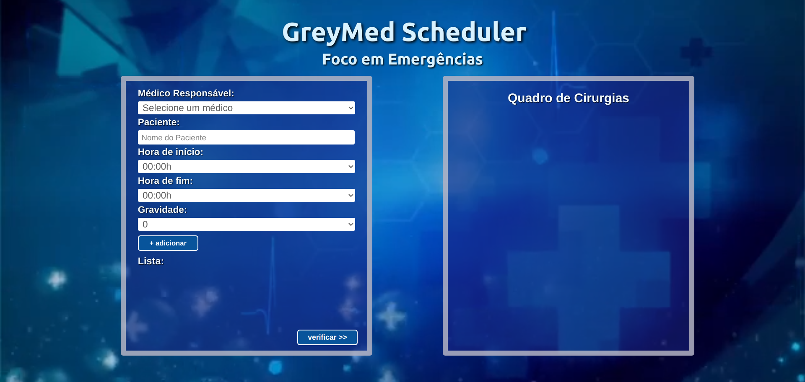
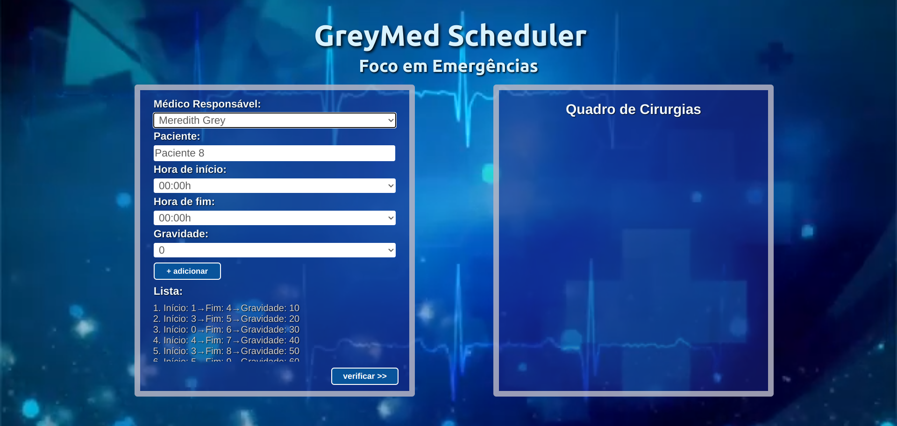
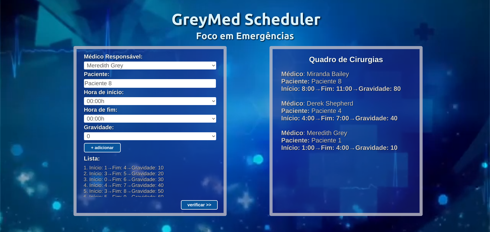

# GreyMed Scheduler: Foco em Emergências 

**Conteúdo da Disciplina**: Programação Dinâmica<br>

## Alunos
|Matrícula | Aluno |
| -- | -- |
| 20/0018442 |  Gabrielly Assunção Rodrigues |
| 20/0023934 |  Maria Eduarda Barbosa Santos |

### Apresentação

[Link para o vídeo de apresentação.](https://unbbr-my.sharepoint.com/personal/200018442_aluno_unb_br/_layouts/15/stream.aspx?id=%2Fpersonal%2F200018442%5Faluno%5Funb%5Fbr%2FDocuments%2FGrava%C3%A7%C3%B5es%2FPrograma%C3%A7%C3%A3o%20Din%C3%A2mica%2D20231209%5F124403%2DMeeting%20Recording%2Emp4&referrer=StreamWebApp%2EWeb&referrerScenario=AddressBarCopied%2Eview)

## Sobre

<p align="justify">
Bem-vindo ao sistema <b>GreyMed Scheduler: Foco em Emergências</b>!  Imagine-se imerso em uma plataforma com temática da série Grey’s Anatomy. Projetado cuidadosamente para priorizar o atendimento mais urgente. Aqui, o algoritmo Weighted Interval Scheduling é a espinha dorsal do atendimento médico, criando uma sinergia entre a arte da medicina e a precisão algorítmica. Cada paciente é cuidadosamente avaliado e classificado de acordo com a gravidade de sua condição, permitindo que os médicos se concentrem nos casos mais críticos. É como uma coreografia complexa, onde o tempo é maximizado e a vida é salva: uma dança entre a urgência e a precisão, garantindo que cada segundo seja dedicado a quem mais necessita.
</p>
<p align="justify">
No coração do sistema <b>GreyMed Scheduler</b> está um método de agendamento inovador. Cada tarefa é registrada no sistema com informações sobre o médico, o nome do paciente, a gravidade e o período estimado de tempo.  Em seguida, o algoritmo Weighted Interval Scheduling entra em ação. Ele analisa a urgência do caso, permitindo uma alocação inteligente do tempo retornando os atendimentos de maior urgência que tenham horários compatíveis!
</p>


## Screenshots

**Imagem 1 - inicio** 



**Imagem 2 - agendamento**



**Imagem 3 - resultado**



## Instalação 
**Linguagem**: JavaScript<br>
**Framework**: Node.js React.js<br>

### Pré-requisitos para rodar o sistema:

- Node.js versão v14.0.0 ou superior <br>

#### Passo 1

- Após a instalação de todos os pŕe-requisitos, dentro da pasta med utilize o comando:
  ```
  npm install

#### Passo 2

- Depois das dependências instaladas:
  ```
  npm start
  
### Pronto, o projeto estará rodando!

## Uso 

<p align="justify">
No <b>GreyMed Scheduler: Foco em Emergências</b>  cada tarefa é registrada no sistema com informações sobre o médico responsável,  nome do paciente, a hora de início e fim da tarefa e a gravidade. O resultado são as tarefas mais urgentes a serem feitas.
</p>

## Outros

> Referência:  <https://abc.com/shows/greys-anatomy>.  Acesso em: 29 nov. 2023.


